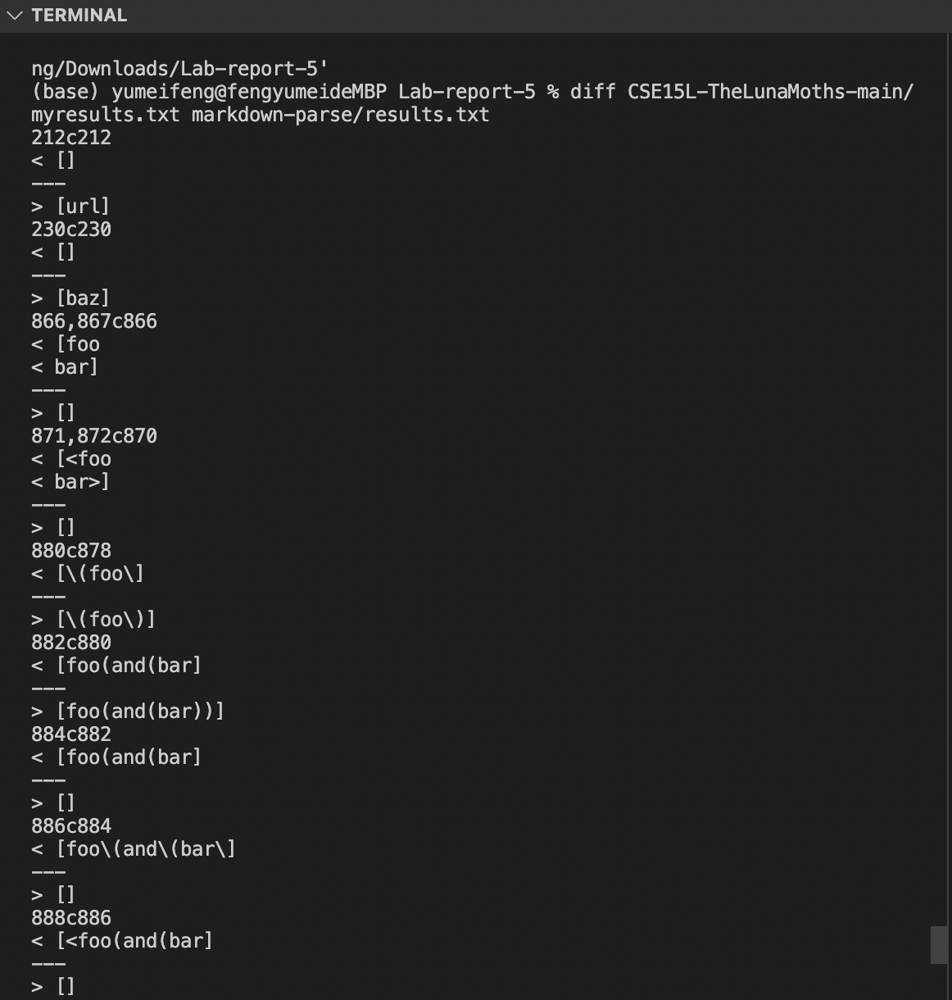
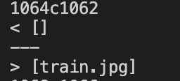
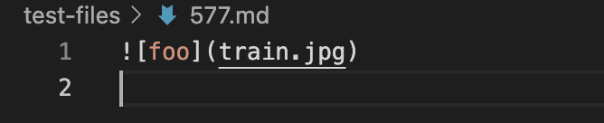
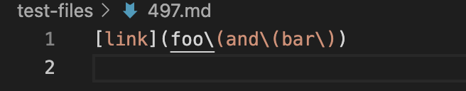

# Lab Report 5

## How I found the tests with different results:

I firsted added a line in script.sh to print the file name with echo and then I use the command diff to find how the output of each file is different. 

 

## For test-file 577

The first line of output shows that there's a diff in the 1064 line for my txt files and 1062 line for the official implementation which corresponds to test-file 577. I looked at test-file 577 and I think my implementation is correct as the link is not valid. I think the bug is that the official implementation fail to recognize that there's a exclamation mark in front of the first open bracket thus considering it as a link. 
Difference shown here:

 

File content shown here:

 

## For test-file 497

The output also shows that there's a diff in the 886 line for my txt files and 884 line for the official implementation which corresponds to test-file 497. I looked at test-file 497 and I think both implementation should be wrong since the correct output should be 'foo(and(bar)'. While my implementaton print out something, the content is not right and the official implementation recognize it as no links. I think the bug is that both implementation fail to recognize that there's the "\" is just an escape symbol and it's not part of the valid link so it should be recognized as part of the link.  
Difference shown here:

File content shown here:

 
